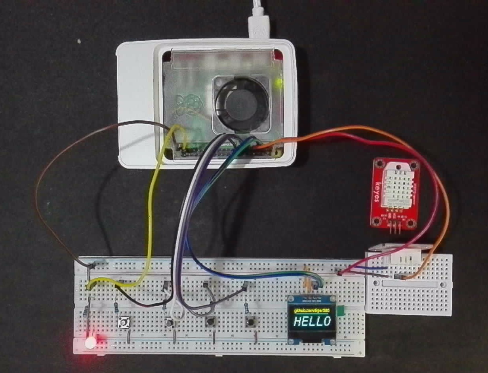
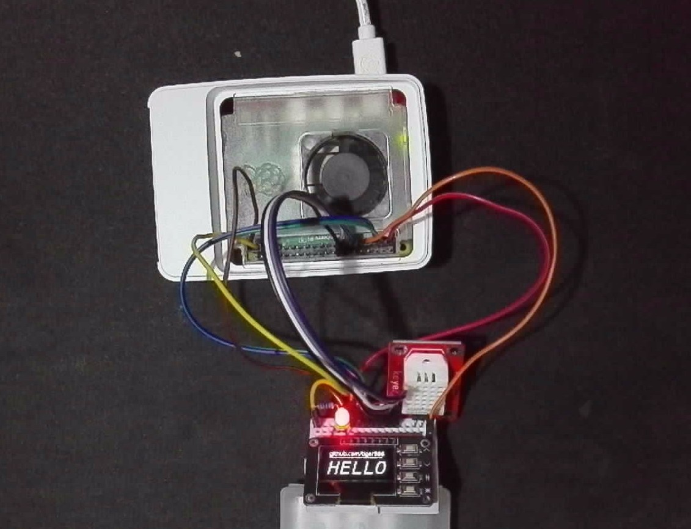

# Raspberry Pi 5 + Go 語言開發：

> ## SSD1306 OLED 顯示系統狀態與 DHT22 溫/濕度感測

## 硬體需求

- Raspberry PI 5（樹莓派 5）
- SSD1306 OLED 顯示器，地址 0x3C
  - raspberry PI 5 開啟 I2C  
  - sudo raspi-config  
  - 選 3 -> I5 -> YES
- DHT22 溫/濕度感應器（選用，可在 .env 設定）

## 連接硬體、線路

### GPIO 接線表

| GPIO                     | Pin | Pin | GPIO                   |
| ------------------------:| ---:|:--- |:---------------------- |
| 3.3V (**+ 正極**)         | 1   | 2   |                        |
| GPIO2 (**SSD1306 SDA**) | 3   | 4   |                        |
| GPIO3 (**SSD1306 SCL**) | 5   | 6   |                        |
| GPIO4 (**DHT22** 數據線)  | 7   | 8   |                        |
|                          | 9   | 10  |                        |
| GPIO17 (**按鈕_1** 10KΩ) | 11  | 12  |                        |
| GPIO27 (**按鈕_2** 10KΩ) | 13  | 14  |                        |
| GPIO22 (**按鈕_3** 10KΩ) | 15  | 16  | GPIO23 (**按鈕_4** 10KΩ) |
|                          | 17  | 18  |                        |
|                          | 19  | 20  |                        |
|                          | 21  | 22  |                        |
|                          | 23  | 24  |                        |
|                          | 25  | 26  |                        |
|                          | 27  | 28  |                        |
|                          | 29  | 30  |                        |
|                          | 31  | 32  |                        |
|                          | 33  | 34  |                        |
|                          | 35  | 36  |                        |
| GPIO26 (**LED** 220Ω)    | 37  | 38  |                        |
| GND (**- 負極**)         | 39  | 40  |                        |

#### 註解：

- **GPIO2 (SDA) 和 GPIO3 (SCL)**：用於 **I²C 通訊**，連接 **SSD1306 OLED 顯示器**。
- **GPIO4**：連接 **DHT22 溫/濕度感測器** 的數據腳。
- **按鈕_1、按鈕_2、按鈕_3、按鈕_4**，使用 **上拉電阻** 各自連接 10kΩ 電阻
- **LED** 連接 220Ω 電阻

### 麵包板線路圖：



如果覺得接電阻、按鈕太麻煩，可以買另一種 SSD1306 有按鈕的，  
只要再接一個 LED 就可以了，如下：



這樣接線會少很多，不用很多電阻、按鈕，而且內建就是上拉電阻喔～

## 軟體安裝使用

1. 安裝 GO，到官網：https://go.dev 下載 Go Linux-ARM64 版本
- 例如：

```
wget https://go.dev/dl/go1.24.2.linux-arm64.tar.gz
```

- 安裝：

```
sudo rm -rf /usr/local/go &&sudo tar -C /usr/local -xzf go1.24.2.linux-arm64.tar.gz
```

- 設定路徑：
  開啟檔案 nano ~/.profile 或是 sudo nano /etc/profile 在最後一行加入

```
export PATH=$PATH:/usr/local/go/bin:$HOME/go/bin
```

- 啟用變更設定，或是重新登入

```
source ~/.profile
或是
source /etc/profile
```


- 查看是否安裝成功

```
go version
```

> 顯示以下資訊，就是成功了～  
> go version go1.24.2 linux/arm64

2. 下載專案

```
git clone https://github.com/tiger586/raspi5-go-status.git
```

3. 將 .env.example 改為 .env，並修改內容符合硬體接線
4. 更新安裝 go 套件

```
cd raspi5-go-status
mv .env.example .env
go mod tidy
```

## 接線完成後，執行測試

```
go run .
```

CTRL+C 可以中斷程式，
中斷、關機，程式都會優雅的關閉。

## 編譯

```
go build
```

預設編譯後檔名為 oled-status，需要編譯後才能設定為服務啟動。

## 檔案說明

程式雖然不難，但是很雜，所以分開多個檔案，裡面沒有使用包，只是單純把程式碼打散

```
imges/    圖片檔，包含示範的 LOGO 圖檔
func.go   樹莓派控制的方法
image.go  16 進制圖片資料 LCDAssistant - Vertical 垂直掃描格式
main.go   主程式
util.go   自用函數
```
✨ [LCDAssistant 下載](https://en.radzio.dxp.pl/bitmap_converter/) ✨

## 放到系統服務，開機自動執行

oled-status.service 檔名隨意
```
 sudo nano /etc/systemd/system/oled-status.service
```

複製內容，並修改您的路徑和檔案名稱，如果您的路徑和編譯後檔案無改變，就可以直接使用。

```
[Unit]
Description=OLED Display Status
After=network.target

[Service]
# 運行程式的使用者，通常是 pi
User=pi           
  
# 您的程式所在的目錄
WorkingDirectory=/home/pi/raspi5-go-status

# 您的可執行檔的路徑
ExecStart=/home/pi/raspi5-go-status/oled-status

# 如果程式崩潰，自動重新啟動 (可選)
Restart=on-failure  

# 將標準輸出重定向到日誌檔案 (可選)
# StandardOutput=append:/var/log/your_program.log  

# 將標準錯誤重定向到日誌檔案 (可選)
# StandardError=append:/var/log/your_program_error.log 

[Install]
WantedBy=multi-user.target
```

檢查是否有錯誤

```
sudo systemctl daemon-reload
```

開機後自動執行

```
sudo systemctl enable oled-status.service
```

立即執行

```
sudo systemctl start oled-status.service
```

重啟服務

```
sudo systemctl restart oled-status.service
```

停止服務

```
sudo systemctl stop oled-status.service
```

取消開機執行

```
sudo systemctl disable oled-status.service
```